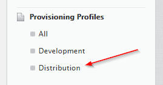
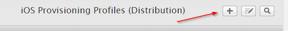
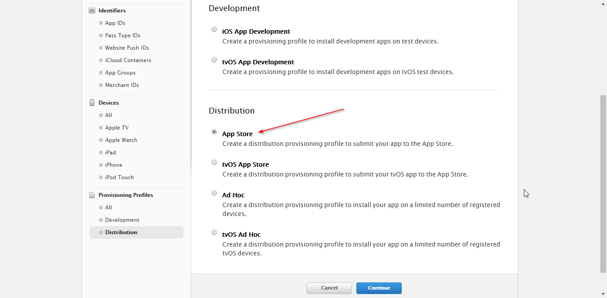
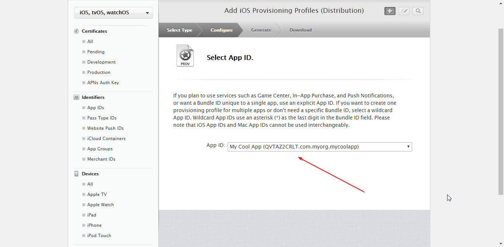
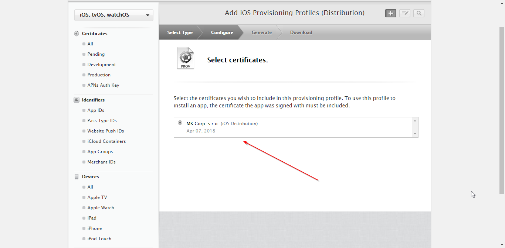
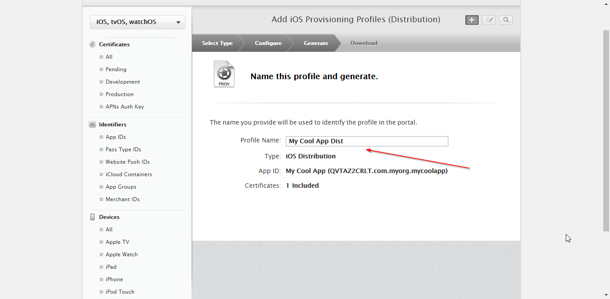
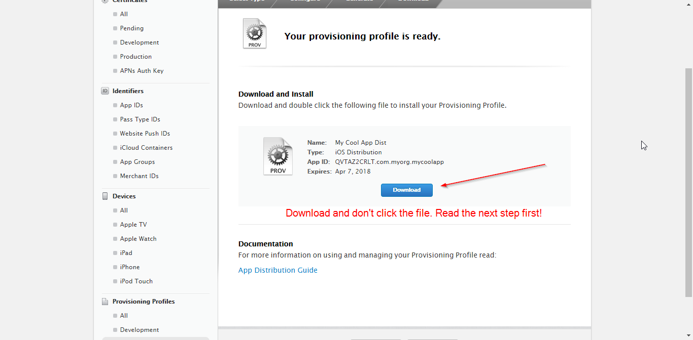

# How to create a distrubution provisioning profile for an iOS app

1. Make sure you've got an *App ID* for your app, if not, check [How to create an iOS App ID](How%20to%20create%20an%20iOS%20app%20ID.md)

2. Go to https://developer.apple.com/account/ and login.

3. Click the *Certificates, IDs & Profiles* menu item.

4. Scroll down and select the *Distribution* menu item (*Provisioning Profiles* section)

5. Click the plus [+] button.

6. Select the *App Store* option under the *Distribution* section and click *Continue*.

7. Select the *App ID* of your app and click *Continue*.

8. Select the certificate of your publishing account / organization and click *Continue*.

9. Input a *Profile Name* for this provisioning profile. This is a just a name for your personal identification, it is not related to the App's name.

10. Download the provisioning profile and don't touch the downloaded file, instead **pay attention to the next step**.

## Important, read first: installing a distribution provisioning profile to your Mac OS and getting its UUID

I was stuck with this part for half a day, because if you just double click the downloaded file, nothing happens. You will also need to figure out the provisioning profile's UUID, which I don't know how to do yet other than:

Assuming you have already installed XCode (you would have need it for dev testing) and you have your iCloud keychain set up (what you normally do while setting up iCloud first time you use your Mac):

1. After you have downloaded your distribution provisioning profile, **don't touch the file**, instead open `/Users/You/Library/MobileDevice/Provisioning Profiles/`. Provisioning profiles get installed to this folder and their file name changes to their UUID.
2. Take a note of UUIDs of any provisioning profiles already installed in this directory. Once you install the provisioning profile you have just donwloaded, you will be able to figure out what is its UUID knowing it's new there.
3. Double click the downloaded provisioning profile's file. It will just do the *launch effect*, but nothing will happen (only XCode might run on background). The provisioning profile will now install to `/Users/You/Library/MobileDevice/Provisioning Profiles/` and will have its UUID as the file name, e.g.: `f44b07a7-d394-4aeb-8757-7cf3e5339da5.mobileprovision`.
4. Re-run `$ pubmate` or `$ pubmate ios` and input this UUID when asked.

## If you have too many provisioning profiles

I just figured out you can actually open the provisioning profile files in a text editor. I was expecting these files to be binary, but they seem to be XML. You can open them to figure out what app are the provisioning profiles for. I might add something to **PubMate** which will list these files with the app they are for.
