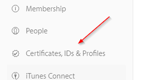
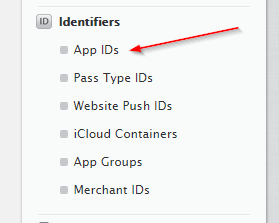
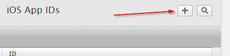
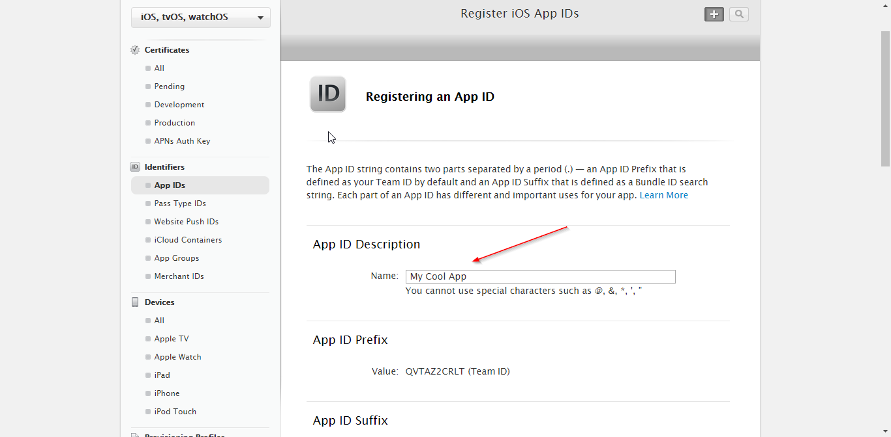
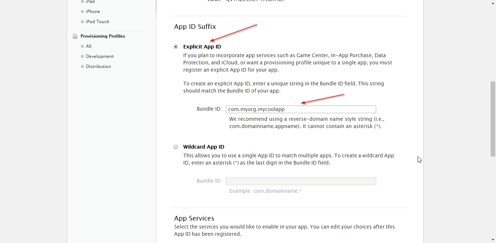

# How to create an iOS app ID

1. Go to https://developer.apple.com/account/ and login.

2. Click the *Certificates, IDs & Profiles* menu item.



3. Select the *App IDs* menu item (*Identifiers* section)



4. Click the plus [+] button.



5. Give the App ID a name, this is not the actual App's name, just for you to know what is this ID for.



6. Make sure the *Explicit App ID* is checked and input the App ID to the *Bundle ID* field. An App ID usually consists of `com.yourorganizatoinname.yourappname`.

**Note:** Normally you want to input the same App/Bundle ID for all platforms. If that's not possible (e.g. the App ID is already taken or you want a different App ID for iOS for some reason), you will have tell Cordova that the App ID for iOS is different in your config.xml:
```
<widget
  id="com.myorg.mycoolapp"
  ios-CFBundleIdentifier="com.myorg.mycoolapponios"
  version="1.0.0"
  xmlns="http://www.w3.org/ns/widgets"
  xmlns:cdv="http://cordova.apache.org/ns/1.0">
```


7. Add any services that you intend to provide in your app.

8. Click *Continue*

9. Review the services summary and click *Register*.

Great job, now you've got your App ID available. Which means you can actually create the app on [iTunes Connect](https://itunesconnect.apple.com) and upload release files (.ipa) to it. These release files need to be signed with a *distribution provisioning profile* (equivalent of a signing keystore on Android). Check [How to create a distrubution provisioning profile for an iOS app](How%20to%20create%20a%20distrubution%20provisioning%20profile%20for%20an%20iOS%20app.md).
